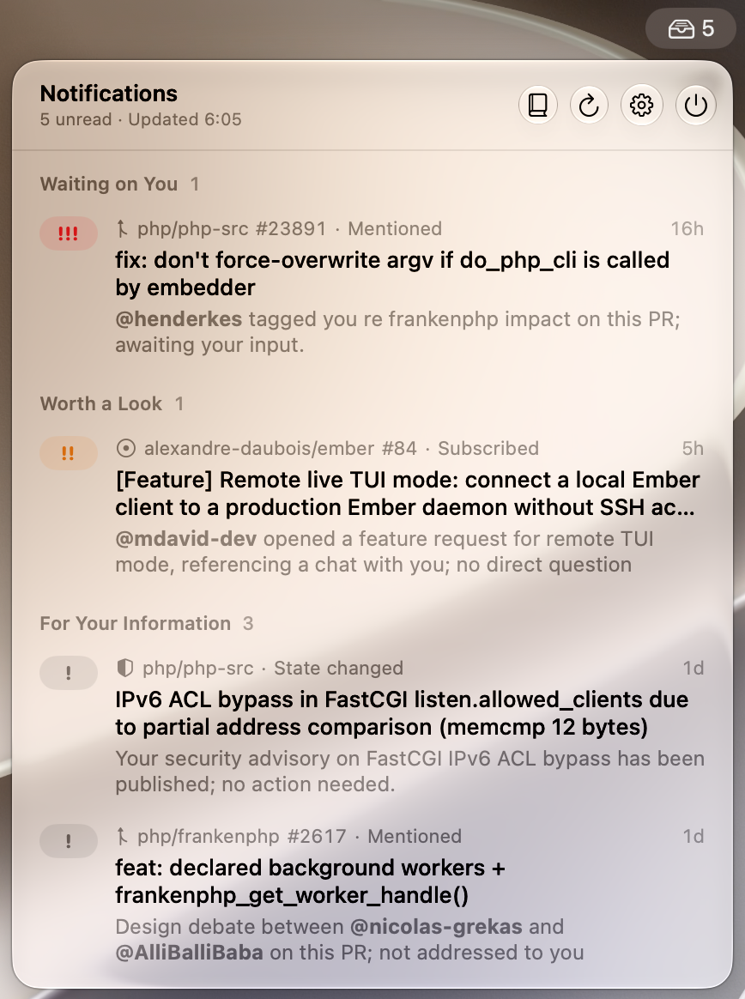

# Atbang: triage your GitHub and GitLab notifications with Claude

Atbang is a free, open-source macOS menu bar app that sorts your unread GitHub notifications and your GitLab to-do items by priority with Claude AI. It reads the recent conversation of each pull request, merge request and issue, and the report of each security advisory. Each thread gets a priority and a one-line summary of who waits on whom, so you can clear your GitHub inbox without opening the threads one by one.

<p align="center"></p>

## Features

- GitHub notifications and GitLab to-do items in one list, from gitlab.com or a self-hosted instance. Each forge works on its own as soon as its CLI is signed in.
- A priority for each unread notification, `!!!`, `!!` or `!`, and a one-line summary that highlights the people involved as `@mentions`.
- A More… link for a longer explanation of what happened last and who should act next.
- Mark as Done from the list, with the checkmark on hover or the right-click menu.
- Grouping by priority or by repository in one click.
- The unread count in the menu bar, which you can hide.
- A choice of Claude model, Haiku, Sonnet, Opus or Fable, and a refresh interval from 1 minute to 1 hour.
- A cache that skips Claude for threads without new activity.
- A native macOS 26 interface with Liquid Glass, in light and dark mode.

## How it prioritizes

Atbang fetches the thread from GitHub and reads the description, the last 30 comments and the last 20 reviews with up to 10 inline comments each. It computes some facts itself: the pull request state, who wrote last, whether someone requested your review, the CI status, merge conflicts, new commits since your review, and whether someone mentioned you since your last reply. Claude reads the description, the 20 most recent entries of the conversation and these facts, then picks a priority.

On GitLab, Atbang reads the description and the last 50 notes of the merge request or issue, system notes included, and computes the same facts where GitLab has them: the state, the draft flag, who wrote last, whether you are still a reviewer who hasn't finished, the review state of each reviewer, the head pipeline status and merge conflicts.

`!!!` means someone waits on you: a review requested from you directly, a question you haven't answered, feedback on your own pull request, or a security advisory assigned to you and still in triage. `!!` deserves a look but nobody waits on you, like activity on your pull request, a review requested from one of your teams, or failing CI on your pull request. `!` keeps you informed about a thread you follow without taking part, a question for someone else, a merged pull request, or a thread where you spoke last.

## Install

Atbang needs macOS 26 Tahoe or later. Homebrew adds the tap and installs the GitHub CLI along the way:

```sh
brew install --cask alexandre-daubois/tap/atbang
```

If you had already added the tap, run `brew update` first so Homebrew sees Atbang. Then sign in to GitHub and install Claude Code if you haven't yet:

```sh
gh auth login
curl -fsSL https://claude.ai/install.sh | bash
claude auth login
```

For your GitLab to-do items, install and sign in to the GitLab CLI too. On a self-hosted instance, add `--hostname gitlab.example.com` to `glab auth login` and set the same host in Settings. Atbang reads GitHub, GitLab or both, depending on which CLI is signed in:

```sh
brew install glab
glab auth login
```

Atbang lands in your Applications folder and runs in the menu bar. It checks the tools when it starts and tells you what's missing. Without Homebrew, install the [GitHub CLI](https://cli.github.com) and the [GitLab CLI](https://gitlab.com/gitlab-org/cli), download `Atbang-<version>.zip` from the [releases](https://github.com/alexandre-daubois/atbang/releases) and move `Atbang.app` to your Applications folder.

## Update and uninstall

```sh
brew upgrade --cask alexandre-daubois/tap/atbang
brew uninstall --cask --zap alexandre-daubois/tap/atbang
```

`--zap` removes the cache and the settings along with the app.

## Privacy and security

Since version 1.0.2, Atbang carries a Developer ID signature and Apple notarizes each release. The app reads from GitHub and GitLab and writes one thing, marking a thread or a to-do item as done when you ask. It takes the token of the GitHub CLI, keeps it in memory and sends it to `api.github.com` alone. GitLab requests go through `glab api`, so the GitLab token never leaves the GitLab CLI, and Atbang refuses any request other than a read, a GraphQL query without a mutation or Mark as Done. `claude -p` runs without any tool, MCP server or settings. Atbang hands it the thread text as untrusted data, tells Claude to ignore any instruction inside, makes it answer through a strict JSON schema and displays the answer as plain text.

## License

MIT
